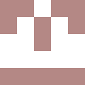
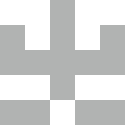

# Identicon Racket


A simple identicon generator written in Racket.

---

## Overview

This is a simple program that generates unique, symmetrical icons from a string input. The core algorithm uses a string hash to determine a unique color and a horizontally mirrored pixel grid, which is then rendered into an SVG file.

---

## Getting Started

### Prerequisites

You need to have **Racket** installed on your system. You can download it from the [official Racket website](https://racket-lang.org/).

### Installation

No special installation is required. Simply clone the repository to your local machine:

```bash
git clone https://github.com/lorenzodantonio/identicon-rkt.git
cd identicon-rkt
```

---

## Usage

Run the program from your terminal and pass a string as an argument.

```bash
racket main.rkt "hello world"
```

This command will generate an identicon for "hello world" and save it as `hello world.svg` in the `output/` directory.

### Visual Example
The program will generate images similar to these:




